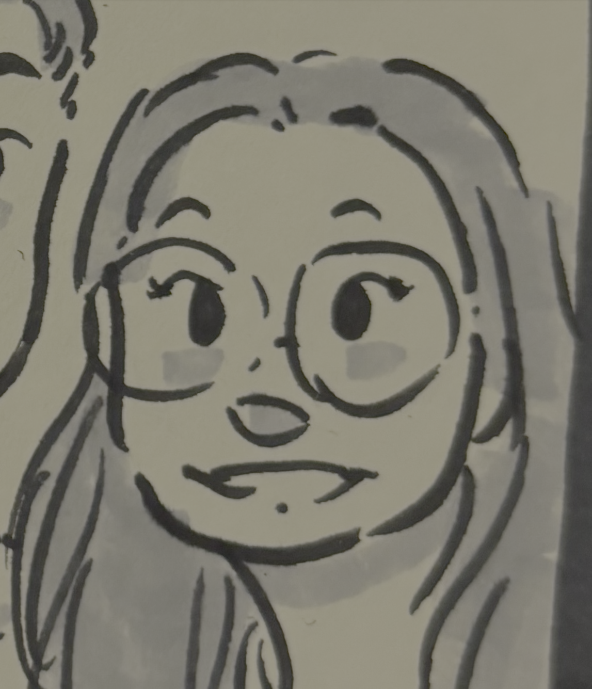
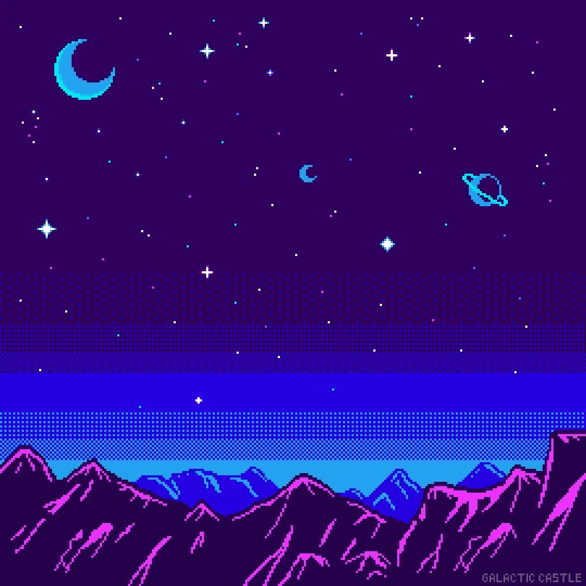

<table>
<tr>
<td>
<h2>halo, welcome!!</h2>
</td>
<td width="100">

</td>
</tr>
</table>

<h3 align="center">AI/ML Research & Engineering</h3>

### about me myself and i

- 🔭 currently working on testing / evaluating models
- 🌱 currently learning MLOps (but also delving into web/widget funsies)
- 📫 reach me on linkedin: Stephanie P.
- ⚡ random things: i write fantasy-adventure novels, i like the color purple & pink, i like collecting figurines, and i am always powered by caffeine

